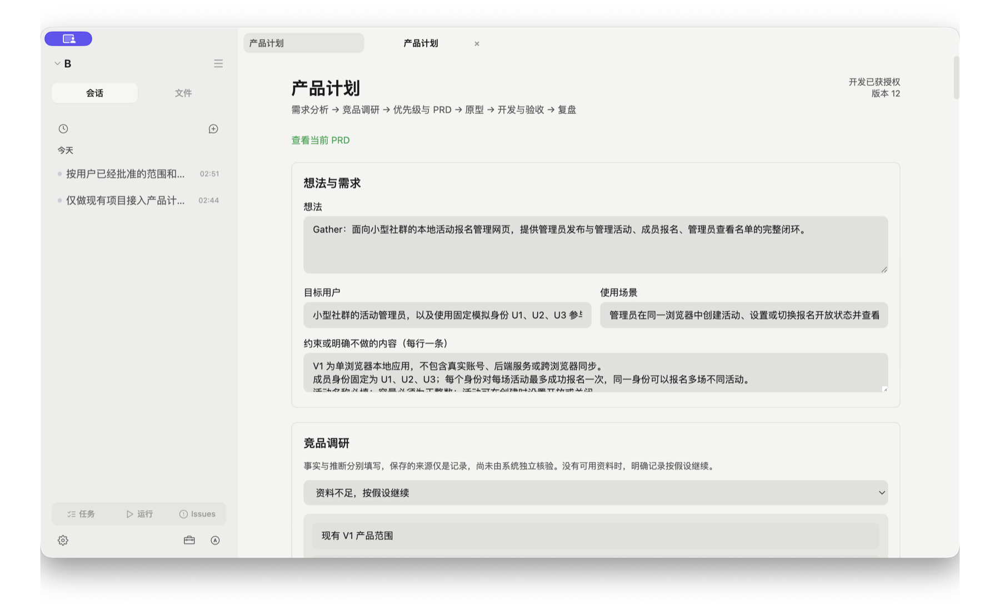
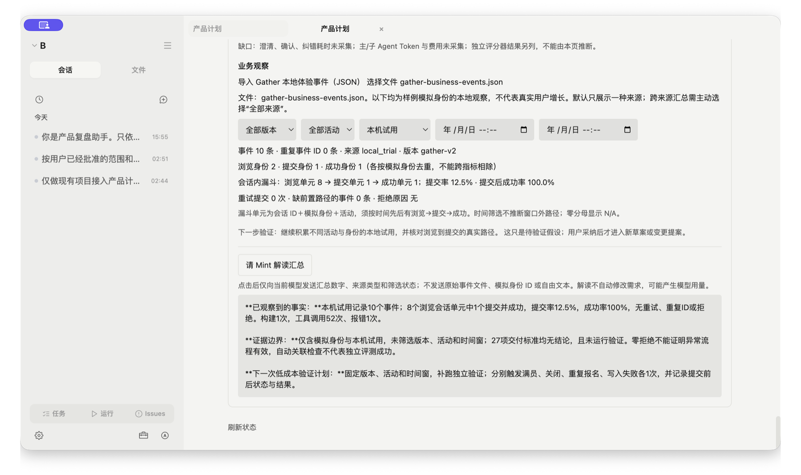

# Product Copilot

把自然语言需求变成可确认的范围、可追溯的变更和有证据的验收。

Product Copilot 是一个本地桌面 AI 产品工作台。它面向需要把想法落地的小型项目：用户先确认需求与原型，再让 Agent 开发；需求变化时，系统保留变更前后差异，并使过期批准和验收结果失效。





[查看 26 秒真实桌面交互演示](assets/demo/product-copilot-walkthrough.mp4)

## 核心体验

`Idea → 需求分析与资料记录 → PRD / 优先级 → 原型确认 → Agent 开发 → 验收证据 → 数据复盘`

交付后的需求通过变更提案继续推进：`提出变更 → 影响与保留项 → 确认范围 → 更新原型 → 开发 → 回归验收`。

- **产品计划**：结构化需求、验收条件、资料来源及待回答问题；资料不足时明确按假设继续。
- **需求变更**：保存前后差异、受影响文件和需保留的规则；需求、原型或产物变化后重新检查批准与证据是否有效。
- **开发控制**：Builder 只在当前范围与原型已批准时执行；P0 按每批最多 2 项推进，取消或失败后重试原批次，运行状态与验收结论分开。
- **证据验收**：运行实际测试，并将用例关联到需求条件；未关联、环境失败、过期证据均不能直接变成通过。人工核验单独留痕。
- **本地复盘**：汇总交付记录与样例事件，区分合成数据和本地试用；缺失成本或人工耗时保持未知。

## 已验证的案例

活动报名应用 Gather 从“每人只能报名一场”改为“每人每场只能报名一次”，保留容量、关闭规则和旧报名。

| 验证 | 当前证据 |
|---|---|
| 改进版完整变更链 | 26 项 P0 条件关联检查通过，Gather 36 项测试通过 |
| 旧数据与业务回归 | 独立领域探针 7 项通过，另有真实页面操作记录 |
| 验收器校准 | 正确样本通过，4 类已知缺陷样本被识别 |
| 对照评测 | 公开固定变更 A/B 均 3/3；DeskFlow 原始需求核心也均 3/3；完整 ShiftLoop 工作流两组均 0/3，B 到达更多阶段但仍未稳定走通 |
| 真实批次 smoke | 新建 3 个 P0 后按 2/1 两批执行，再进入一次集成补缺；三轮均由桌面产品入口触发，集成结束后停止继续开发 |
| 工作台可靠性 | 已实测页面取消真实 shell、缺依赖未判定、批准失效，以及 Electron 在 shell 执行中强杀后的子进程清理与状态恢复 |
| 本地数据复盘 | 10 条本机试用事件得到 8→1→1 漏斗；真实 Mint 解读保持模拟数据、独立评测和异常路径的证据边界 |

这些是本地开发验证与公开单案例实验，不是线上用户增长、生产可靠性或统计显著的对照结论。

- [项目案例与产品决策](PROJECT_STORY.md)
- [产品规格与开发记录](docs/product/README.md)
- [对照评测运行册](evaluation/T7_对照评测运行册.md)、[固定变更对照](evaluation/formal-ab-20260921/README.md)、[独立未见案例](evaluation/holdout-sla-20260921/README.md)、[完整工作流对照](evaluation/full-workflow-ab-20260921/README.md)与[真实批次 smoke](evaluation/batched-build-smoke-20260921/README.md)
- [首轮预实验记录](evaluation/pilot-20260921/README.md)
- [异常路径记录](evaluation/reliability/20260921.md)

## 本地运行

准备 Node.js 与 npm，克隆仓库后启动：

```sh
git clone https://github.com/20cldeng-pixel/Product-Copilot.git
cd Product-Copilot
npm ci
npm run dev
```

在设置中配置供应商并完成登录或密钥配置，打开项目后点击“产品计划”。本项目验证使用了 OpenAI Codex 供应商；模型可用性以实际账户为准。`.easymint` 数据目录、npm 包名和当前开发安装包名称继续保留兼容标识。

```sh
npm run lint
npm test
node --test evaluation/summarize-session.test.mjs
npm run build:renderer
npm run build:main
npm run build:preload
```

本地开发验证使用 Node.js 24；CI 配置使用 Node.js 22。[桌面包提交的公开 CI](https://github.com/20cldeng-pixel/Product-Copilot/actions/runs/35579961623)已通过主项目质量门禁与 Gather 示例检查。本机已从提交 `18bfba8` 生成、校验并实际启动 macOS arm64 开发 DMG；镜像、Finder 应用和窗口均显示 Product Copilot，并能读取旧版数据。该包未签名、未公证，作为[开发预览版下载](https://github.com/20cldeng-pixel/Product-Copilot/releases/tag/product-copilot-v0.1.0-dev)发布，详见[构建记录](evaluation/builds/20260921-macos-arm64.md)。

## 运行 Gather 示例

```sh
cd examples/gather
npm ci
npm test
npm run dev
```

示例使用固定模拟身份和浏览器本地存储；包含已验证的 V2 代码及本地事件导出。源码快照摘要见 `examples/gather/SOURCE.json`。

## 结构

| 路径 | 职责 |
|---|---|
| `app/main/services/product-*` | 产品状态、批准、开发、证据与复盘服务 |
| `app/shared/product-*` | 数据契约与共享逻辑 |
| `app/renderer/src/components/Product*.tsx` | 产品计划界面 |
| `evaluation/` | 校准、预实验及证据索引 |
| `docs/product/` | PRD、需求合同和开发记录 |

技术栈：Electron、React、TypeScript、Vite、Vitest，以及 Pi Agent 引擎。计划和会话保存在本机；调用模型或联网工具时，相关上下文会发送至所配置的供应商。不要将凭据、私人会话或真实用户事件提交到仓库。

## 当前边界

正式重复固定变更执行对照已完成：公开 Gather 案例 A/B 均为 3/3。独立 DeskFlow 案例的原始需求核心也均为 3/3；扩展合同 A 为 0/3、B 为 3/3，但差异来自额外 schema 条款，不能解释为同一用户任务的成功率提升。完整 ShiftLoop 工作流 A/B 各运行 3 次，在 300 秒单轮上限下均为 0/3；A 都在首轮直接实现时超时，B 到达更多阶段，但两轮仍提前开发且全部未完成。分批改进已用真实桌面入口完成一个 3 P0 的前瞻 smoke：2/1 两个需求批次和一次集成补缺均正常结束，并修复集成结束后可重复启动的问题；这不是重复 A/B。真实人工耗时与返工次数未知，当前证据不支持成功率、耗时或成本改善。可靠性方面，已在真实产品页面中取消正在执行的前台 shell，并在 shell 分阶段写入中对 Electron 主进程执行 `SIGKILL`；守护进程清理了命令进程组，延迟写入未发生，重启后记录恢复为 `interrupted/not_run`。仍未进行真实外部供应商故障注入；这些结果不代表全部 UI 或生产环境正确。示例事件使用模拟身份，不支持真实业务转化率结论。

## License

基于 [EasyMint](https://github.com/tianemon/EasyMint) 开发，沿用 MIT 许可；原始版权声明见 [LICENSE](LICENSE)。
