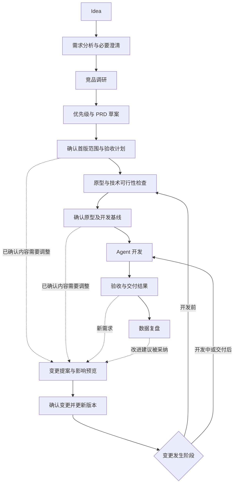

# EasyMint Product Copilot：完整产品主线 PRD v0.3

日期：2026-09-20。状态：设计规格，尚未实现或运行验证。

本文更新整体产品范围：首版同时包含从 Idea 创建 V1，以及对已确认内容进行变更并交付 V2。此前 [v0.2](./00_需求变更主线_PRD_v0.2.md) 保留为变更执行子流程；它对整体首版“只处理已有项目”的限制由本文替代。Starter、CHG-001、需求合同和 EVAL-01 的行为标准继续有效。

## 1. 产品目标与首版边界

帮助非技术产品人员把想法做成可运行的小型应用，并在后续修改中保持需求清楚、影响可见、结果可验证。用户在一个项目中完成创建与迭代，无需切换到另一套产品。

首版支持本地 React/TypeScript 小型 Web 应用、模拟身份和本地数据；以活动报名工具贯穿演示。创建链路允许模型依据需求生成应用，不能用固定答案或预录成功结果冒充 Agent 执行。任意历史仓库接管、真实登录/支付、并发容量保证和云端发布暂不作为首版交付要求。

主线各环节均有入口、产出和可观察状态。减少的是各环节的深度与自动化范围，不删除竞品调研、原型或复盘来换取“全流程完成”。缺少资料或验证能力时展示缺口，不能静默跳过并标完成。

## 2. 两条流程如何组成一个产品



上图的变更执行出口按发生阶段决定：尚未开始开发时，更新需求后返回原型/开发确认；原型与开发批准已随变更一并完成且仍有效时，可直接进入开发准备。已交付或已在开发时，按更新后的基线修改代码并重新验收。新原型若尚未展示确认，旧开发批准保持失效，不能直接启动 Builder。早期需求修改不能被路由成一次没有代码的“业务验收通过”。

未确认草案可直接编辑，保留草案修订记录。涉及已确认范围、验收标准或原型行为时生成 ChangeProposal。技术修复只要不改变已确认行为，可在既有执行授权和预算内继续；超出范围则回到提案。

## 3. 每个环节首版做到什么程度

| 环节 | 用户能够看到或操作的结果 | 完成条件 |
|---|---|---|
| Idea 与需求分析 | 目标用户、场景、核心任务、约束、待回答问题；事实和假设分开 | 会改变业务结果的阻塞问题已解决，其余假设可见 |
| 竞品调研 | 少量相关产品的来源卡、比较表及对本项目的建议 | 达到事先限定的范围，事实可追溯；不足项明确标记 |
| 优先级与 PRD | 本次做/以后做/不做的需求、理由、依赖和验收条目；可编辑 | 本次范围可实现、可验证，关键依赖无遗漏 |
| 原型 | 核心路径可交互，能预览并提交反馈 | 原型对应当前需求版本，关键状态已展示并获得用户确认 |
| Agent 开发 | 当前任务、执行进度、实际改动、阻塞与资源消耗 | 生成真实产物并进入验证，执行结束不等于交付通过 |
| 验收 | 逐条通过/失败/未判定、自动与人工检查、原始证据入口 | 所需检查有对应证据；缺口与人工决定不会被绿色总状态掩盖 |
| 数据复盘 | 交付质量与业务观察两个视图；建议可转为新提案 | 计算口径、数据来源和适用范围可查，无数据时明确展示空态 |

优先级统一为 P0（本版必做）、P1（候选增强）、P2（后续）。优先级不等于是否已承诺；只有本次确认范围内的需求才进入开发基线。首版用用户价值、依赖和实现成本解释取舍，不生成没有依据的精确评分。

PRD 在原型前形成草案，原型反馈可以修订它。最终开发基线引用同一组结构化需求的已确认版本；导出的 PRD 和 task.json 都是视图，不能各自成为另一份需求真相。

## 4. 竞品调研的运行标准

默认围绕最多两个会影响首版取舍的问题，对比最多三个相关产品，读取最多六个详情页面；达到上限或已能支持取舍时停止。具体上限作为配置展示，不以凑满数量作为质量标准。

每条来源记录 URL 或用户材料引用、读取时间、支持的观察事实、可访问状态；事实摘要与模型推断分栏。营销页面只能证明对方公开宣称某能力，不能自动升级成实际体验结论。未发现某项信息不等于对方没有该功能。

输出按“观察 → 对当前场景的意义 → 建议/假设 → 关联需求”组织。竞品具备某功能不能单独证明目标用户需要它；后续发现的新信息只提出修改建议，不能自动改写已确认范围。

没有可用联网工具或资料不足时展示原因，允许用户补充材料，或明确选择“按当前假设继续”。该阶段记为证据不足下继续，不记调研已验证。用户在创建时明确选择快速探索，可预先授权资料不足时继续，但结果必须显示剩余假设；涉及核心可行性的不确定项仍需处理。

## 5. 确认节奏与技术反馈

创建默认有两个主要确认节点：

1. **确认首版范围**：用户在同一页面看到目标、调研建议、P0 范围、主要假设和验收计划，决定是否进入原型。
2. **确认并开始开发**：用户预览原型，并看到相对上次确认的变化、技术可行性结论、验证方法与执行预算，再授权开发。

上述确认合并了需求/调研/PRD等阶段的重复弹窗，不减少用户对关键业务决策的可见性。用户主动要求逐项审核时可停留逐项编辑，但首版不另建一套多模式编排引擎。

交付后的“接受当前版本”“人工验证”“接受且保留例外”是独立使用决定；自动通过本身不要求用户再点一次确认才能记录事实。拒绝结果可以反馈缺陷或提出新需求，二者分别处理。

可行性检查复用现有技术方案能力。高不确定项先做最小技术探针，并记录成功或失败证据；不能仅凭 Builder 一句“太难”取消需求。业务方案需要降级时，把代价和替代方案交还 Mint，汇总到下一次确认中。UI 配色等可逆细节使用可见默认值，不逐项打断。

确认绑定内容版本。变更影响到已确认原型或验收标准时，在同一张变更确认卡中展示新内容并重新确认，不继续沿用旧批准。

## 6. 变更在不同阶段的处理

| 发生时点 | 处理方式 | 返回位置 |
|---|---|---|
| 范围尚未确认 | 直接更新草案及相关分析，不强制生成正式提案 | 当前分析/PRD阶段 |
| 范围已确认、原型未确认 | 提案列出范围与验收差异；同步更新相关原型 | 原型及开发确认 |
| 原型已确认、开发未启动 | 显示受影响需求、界面与标准，合并一次确认 | 开发准备 |
| 开发正在进行 | 保存提案草案；当前写任务安全停止或完成后固定产物，再基于最新版本确认并执行 | 受影响开发与验证 |
| 已交付 | 按 CHG-001 模型分析影响、保留旧行为、更新代码并回归 | 新版本交付与复盘 |

同一项目只允许一个代码写任务运行。聊天里可以同时收集新想法，但未确认的想法不会混入正在执行的正式任务；确认前若基础产物已变化，需要重新核对影响。

变更就绪条件按阶段检查。v0.2 中“Starter 基线已验证、代码影响有依据”适用于已有代码的变更；开发前使用已确认需求/原型版本作为基础，不要求尚不存在的代码先通过测试，但必须说明对应产物与验收计划的变化。

原型更新后回看相关验收标准；代码更新后旧证据不可直接计入新产物。历史关联、推测影响和当前已核验关联必须区分。本案例核心回归完整执行，不以影响分析结果代替回归范围。

## 7. 最小界面结构

复用原聊天区、原型预览、任务和运行能力，新增项目级“产品进度”工作区。用户首先看到当前产物和下一步，而不是 Agent 内部调度。

```text
项目：活动报名工具                         当前：原型待确认

需求与调研  →  范围与 PRD  →  原型  →  开发与验收  →  复盘

左侧：与 Mint 对话        主区域：当前阶段产物，可查看历史版本
                         需求 / 来源 / 原型 / 验收条目

底部：阻塞问题、剩余假设、本次预算        [调整] [确认并开始开发]
```

用户说“改一下……”时打开变更卡，原项目上下文保留；卡片沿用 [CHG-001](./02_CHG-001_变更提案.md) 的目标、影响、保留项和验收计划。界面默认展示业务对象，文件和日志在次级入口。

阶段完成与内容有效性分开。历史已完成的 PRD 若被后续变更影响，显示“有更新待确认”，不假装从未做过，也不继续显示当前内容已批准。

## 8. 共用的数据与执行底座

沿用现有 Project，在其下新增一份 **ProductPlan** 持久化记录，承载 Brief、调研来源与结论、阶段状态、当前需求版本引用、原型引用、指标定义和批准记录。四类既定业务对象继续共用：

| 对象 | 创建和迭代共同职责 |
|---|---|
| Requirement | 保存行为、来源、优先级、版本及验证计划；草案与已批准版本分开 |
| ChangeProposal | 修改已确认承诺时保存差异、影响、保留项与确认 |
| Run | 每次开发/验证执行、预算、尝试、固定产物、用量及人工决定 |
| Evidence | 对具体标准的实际观察，绑定需求、产物及检查版本 |

初始创建批准保存在 ProductPlan，不伪造一个“已有需求版本”来套变更；正式迭代沿用 ChangeProposal。文档导出和界面读取相同状态。

ProductWorkflowService 由主进程实现，校验状态与权限、保存确认、串行调度、固定产物并汇总证据。Mint 负责理解/解释并调用工具；Builder 写代码；既有设计能力生成原型；Runner 执行检查；Evaluator 解释检查结果。调研可由 Mint 调用受控检索工具，不因增加一个页面而新增一个常驻 Agent。

服务动作包括保存草案、登记来源、提出范围、提交原型、确认范围、确认开发、提出/确认变更、执行验证、记录人工决定、生成复盘。确认身份由界面和宿主绑定，模型输出中的 approved=true 不构成批准。

上下文按阶段装配：分析给 Brief/来源摘要；原型给当前范围与交互；开发给已确认需求和必要代码；验收给冻结合同与产物；复盘给结果摘要和按需证据。工具输出和日志也计入上下文及预算，不全量重复历史。

重复启动去重、版本检查、单项目串行写、重启后标记中断、代码变化后证据失效等基础约束继承 v0.2。成本/时长上限在每次运行前记录；首版默认每个执行批次最多两轮自动修复，仍失败则输出事实和可选下一步。用户可显式增加预算，不能无限循环。

## 9. 数据复盘必须有可核查的数据入口

**交付质量视图**：分别展示创建和变更的需求覆盖、失败/未判定项、返工次数、澄清/确认/纠错、人工验证时间、主/子 Agent 用量及总耗时。用户界面里的自动通过率不等于独立评测实际成功率；后者来自外部评分器。未知费用显示未知，独立评分器成本另列。

**业务观察视图**：首版在活动报名样例中提供最小本地事件采集：活动浏览、报名提交、报名结果，带事件 ID、会话、模拟用户、活动、产物版本、时间与来源标记。分析页面展示活动浏览人数、提交人数、成功人数及拒绝原因。先由确定性计算生成数值，模型只解释并提出假设。

最小统计口径：先按产物版本、活动、数据来源及时间范围筛选，再按 eventId 去重。“浏览/提交/成功人数”分别按 mockUserId 去重，同一用户跨会话不会重复计人数。

另设“会话内漏斗”，以 sessionId+mockUserId+activityId 为分析单元，要求浏览→提交→成功按时间先后发生。会话内转化率的分子、分母均使用该单元，不能套用人数指标。重试次数另列；记录不完整或未发生前置浏览的直接测试操作列为非漏斗事件。零分母显示 N/A；该窗口分析不推断窗口外的访问路径。

测试和演示事件始终标为 synthetic，普通本机试用标为 local_trial，分开展示。默认页面可以演示合成数据，但不得把它包装成真实获客、转化提升或留存效果；无事件时展示空态和采集说明。首版不做通用埋点平台、自动接入外部生产数据或因果归因。

业务事件采集不能影响报名状态或让失败请求变成成功；采集失败单独提示数据缺口。数据不足时复盘给“待验证假设与下一次验证计划”。建议经用户采纳后转成草案或变更提案，不能直接驱动代码修改。

## 10. 贯通案例与首版验收出口

演示输入：“为一个小型社群做活动报名工具，用户能查看活动、报名、看到结果。”第一轮须澄清或明确采用报名限制、名额、开放状态和数据保存方式；为了衔接 CHG-001，演示用户明确选择 V1 全局限报一次。这是公开测试脚本，不可悄悄硬编码成所有创建项目的默认规则。

完整演示：分析与有来源调研 → 范围/PRD → 原型 → V1 真实开发和验收 → 收集示例事件并复盘 → 用户提出“每人每场一次” → CHG-001 → V2 和回归证据 → 再次复盘。

首版必须同时满足：

1. 创建主线全部有真实入口与产物；调研不足、技术阻塞和验证失败都有明确出口。
2. 至少一次真实模型完成创建与后续变更；可修改需求输入，系统能更新产物而非播放固定脚本。
3. 已确认范围/原型的变化能触发正确的重新确认；未确认草案修改不产生多余批准循环。
4. 验收器能识别正确实现、未改全局限制、放开同场重复和丢失旧数据等校准产物。
5. 复盘能从实际运行记录和带来源的事件数据计算结果；空数据与合成数据不产生真实增长结论。
6. 运行失败、预算耗尽、取消、中断以及人工接受不会被当作机器全部通过。

这组标准是首版验收清单，不是已完成成果。

## 11. 演示与评测分开

创建评测从相同 Idea、约束、用户回答脚本及资源上限出发，检查目标理解、来源可靠性、范围/原型一致性和最终业务行为。系统自己生成的合同不能作为唯一正确答案；评分标准从公开目标与合法澄清独立建立。

变更能力比较仍从同一个冻结 Starter V1 开始，沿用 [EVAL-01](../../evaluation/author-only/EVAL-01_独立评测案例.md)，避免创建质量不同污染变更结论。EVAL-01 继续是公开开发校准案例，不声称未见泛化。

创建后继续修改的贯通试验单独记录，回答整条用户路径能否完成。两阶段成功率分别报告，贯通成功要求均满足；不能只展示成功的 V1，也不能把变更评测结果推广为整个创建链路可靠。

## 12. 现有能力与新增贡献的边界

本轮静态核对基于 EasyMint 固定提交 `1cdc0c80c610539688aed0a54d45f23e991d8b18`（v0.27.1），不是对未来上游状态的保证；未安装依赖或启动应用。

| 环节 | 已看到的上游依据 | 本项目计划新增 |
|---|---|---|
| 创建与分析 | [项目创建入口](https://github.com/tianemon/EasyMint/blob/1cdc0c80c610539688aed0a54d45f23e991d8b18/app/renderer/src/components/NewProjectDialog.tsx#L223) 与意图采集指引 | 结构化 Brief、阶段结果和问题状态 |
| 调研 | [联网工具装配](https://github.com/tianemon/EasyMint/blob/1cdc0c80c610539688aed0a54d45f23e991d8b18/app/main/services/builtin-mcp.ts#L157) | 有限调研任务、来源卡、建议关联需求 |
| 范围与 PRD | [需求拆解约定](https://github.com/tianemon/EasyMint/blob/1cdc0c80c610539688aed0a54d45f23e991d8b18/app/shared/prompts.ts#L180) | 统一优先级、单一需求状态、批准版本 |
| 原型 | [原型预览工具](https://github.com/tianemon/EasyMint/blob/1cdc0c80c610539688aed0a54d45f23e991d8b18/app/main/services/builtin-mcp.ts#L49) | 原型与需求绑定、真实批准、变更失效机制 |
| 开发与验收 | [子任务完成回写](https://github.com/tianemon/EasyMint/blob/1cdc0c80c610539688aed0a54d45f23e991d8b18/app/main/services/task/tool.ts#L253) | 执行完成与业务通过分离、固定合同与证据、变更回归 |
| 复盘 | 会话统计及 [经验沉淀工具](https://github.com/tianemon/EasyMint/blob/1cdc0c80c610539688aed0a54d45f23e991d8b18/app/main/services/tools/learn-tool.ts#L48) | 按项目目标复盘、人工成本、独立评测结果和样例业务观察 |

已有提示词/执行入口不等于已验证可靠。实现前依次检查工具权限、联网可用性、原型预览、结构化结果校验和状态回写。原版普通模式保留；产品工作流启用结构化状态后，不允许沿用旧提示词的直接标 done/跳过确认逻辑绕过服务。

实现任务和出口见 [首版实现任务与验收](./04_首版实现任务与验收.md)。
